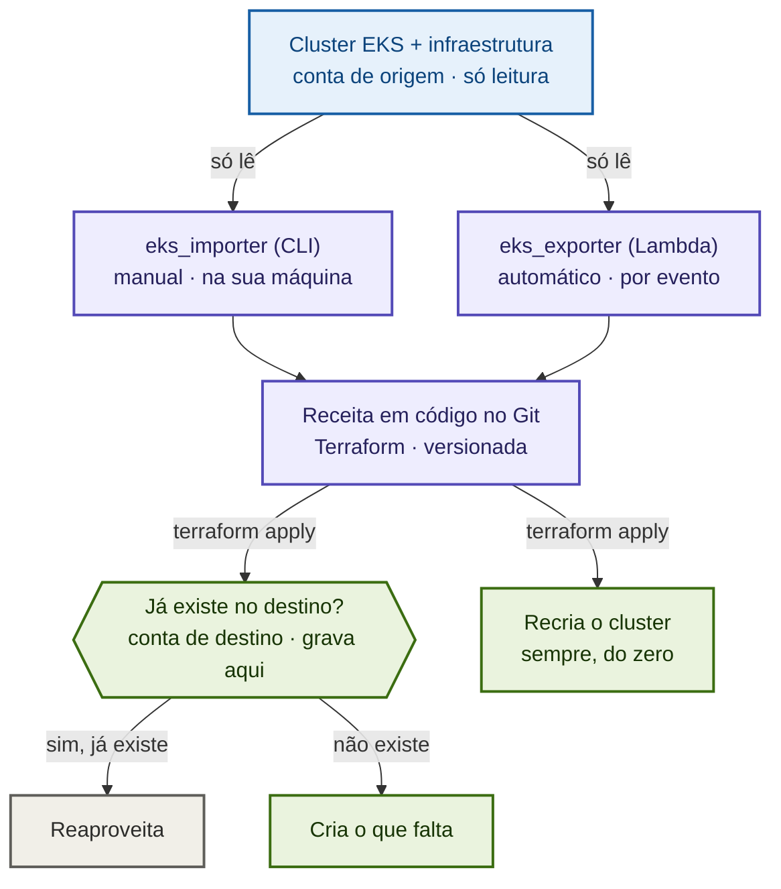
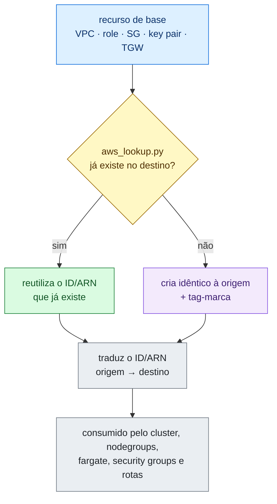

# EKS-TERRAFORM-DR

> **Recuperação de desastre (DR) e migração de clusters Amazon EKS entre contas AWS.** A ferramenta lê um cluster Kubernetes já existente e gera, automaticamente, o código de Infraestrutura como Código (Terraform) que o recria onde for preciso.

## Em resumo

Um cluster Kubernetes crítico, onde rodam as aplicações de produção, muitas vezes é criado manualmente no console da AWS, sem nenhum código que o descreva. Se esse cluster for apagado por engano, ou se for preciso movê-lo para outra conta, reconstruí-lo na mão é demorado, arriscado e difícil de auditar.

Este projeto resolve esse problema: ele **inspeciona um cluster EKS existente e gera sozinho todo o código Terraform necessário para reconstruí-lo**, na mesma conta (recuperação) ou em outra conta (migração / DR). O diferencial é que o código gerado **verifica o que já existe no destino e cria apenas o que falta**, então o mesmo material funciona em qualquer cenário, sem reescrita manual.

> Em termos de negócio: transforma a recuperação de um cluster, antes um procedimento manual, demorado e propenso a erro, em um processo **automatizado, versionado e auditável**.

## O que este projeto demonstra

| Área | Competências aplicadas |
|---|---|
| **Infraestrutura como Código** | Geração programática de Terraform modular; idempotência; gestão de *state*; estratégia *find-or-create* |
| **AWS (profundidade)** | EKS, VPC e roteamento, IAM, Transit Gateway, Lambda, KMS, AWS RAM; portabilidade **cross-account** |
| **Python** | Dois produtos (CLI + Lambda) sobre uma **base de código compartilhada**; integração via AWS CLI e `boto3` |
| **DevOps / SRE** | *Disaster recovery*, automação *event-driven*, integração com GitLab (commit automatizado), *least privilege* |
| **Engenharia de software** | Separação de responsabilidades (*collectors / templates / lookup*), tratamento de erros deliberado, documentação técnica |

> **Contexto:** projeto desenvolvido para resolver um caso real de DR de clusters EKS criados fora do IaC. Publicado como peça de portfólio.

---

## Índice

- [Em resumo](#em-resumo)
- [O que este projeto demonstra](#o-que-este-projeto-demonstra)
- [O problema](#o-problema)
- [A ideia central](#a-ideia-central)
- [Arquitetura](#arquitetura)
- [Dois empacotamentos: CLI e Lambda](#dois-empacotamentos-cli-e-lambda)
- [As três fases](#as-três-fases)
- [O mecanismo find-or-create](#o-mecanismo-find-or-create)
- [Cenários de uso](#cenários-de-uso)
- [O que é capturado e recriado](#o-que-é-capturado-e-recriado)
- [Quickstart (CLI)](#quickstart-cli)
- [Estrutura do repositório](#estrutura-do-repositório)
- [Decisões de engenharia](#decisões-de-engenharia)
- [Limitações conhecidas](#limitações-conhecidas)

---

## O problema

Você tem um cluster EKS que **não** nasceu no Terraform, foi criado no console, por scripts ou "na mão". Não há código versionado que o descreva, e portanto não há forma simples e reproduzível de:

- **recriá-lo** após uma exclusão acidental (DR na mesma conta);
- **migrá-lo / cloná-lo** para outra conta (DR cross-account, prod → staging);
- trazê-lo para dentro do IaC sem reescrever toda a infraestrutura do zero.

O complicador é que **IDs de rede** (VPC, subnet, SG) e **ARNs de IAM** mudam entre contas, e o destino quase nunca está num estado binário "totalmente vazio" ou "totalmente pronto" , geralmente *algumas* coisas já existem e *outras* não.

## A ideia central

**Em linguagem simples:** é como mudar de casa levando os móveis. Ao chegar no lugar novo, você verifica o que ele já tem, se já existe geladeira, você não compra outra, se falta a cama, você leva a sua. O código gerado faz exatamente isso com a infraestrutura: aproveita o que o destino já oferece e só recria o que está faltando.

**Tecnicamente**, isso é a estratégia **find-or-create**. O Terraform gerado **não assume** que a conta de destino está vazia nem cheia. Para cada recurso de base (VPC, subnets, security groups, IAM roles, key pairs, Transit Gateway…), em tempo de `plan` ele pergunta ao destino *"isto já existe aqui?"*:

- **se já existir** → reutiliza o ID/ARN existente (não recria).
- **se não existir** → cria um idêntico ao da origem.

> Para cada recurso, **antes de criar qualquer coisa**, o Terraform pergunta à conta de destino se aquilo já existe. Se existe, reaproveita, se não, cria um igual ao da origem.

Quem responde a essa pergunta é o helper `aws_lookup.py`, chamado pelo Terraform como um `data.external` durante o `plan`. É isso que permite que o **mesmo** conjunto de arquivos funcione em qualquer cenário, conta nova, *landing zone* padronizada ou recuperação na mesma conta, com pouca ou nenhuma edição.

---

## Arquitetura

Duas contas AWS, um artefato no meio. A captura exige apenas permissões de **leitura** na origem, a escrita acontece toda no `terraform apply`, na conta de destino. O módulo Terraform gerado é a única coisa que cruza a fronteira, e é idêntico independente do destino.

### Topologia

Duas contas AWS com fronteiras de permissão distintas, e um único artefato versionado entre elas. Na origem, só leitura; toda a escrita acontece no destino, durante o `apply`.



A decisão "reutilizar ou criar" **não** é tomada na geração , fica deferida para o `plan`, quando o `aws_lookup.py` consulta o destino e já sabe o que existe lá. Por isso o mesmo pacote cobre recuperação na mesma conta e migração cross-account sem reescrita, e é idempotente por construção.

### Fluxo de controle: `plan` e `apply`

O processo tem dois momentos, e essa é a parte mais simples de explicar:

1. **`terraform plan` , só olha, não muda nada.** O Terraform consulta a conta de destino e, recurso por recurso, descobre o que já existe lá.
2. **`terraform apply`, agora age.** Cria só o que faltava e recria o cluster EKS.


> **Dois empacotamentos, um artefato.** A captura roda como CLI (`eks_importer`, via AWS CLI, grava em disco) ou como Lambda (`eks_exporter`, via boto3, faz push no GitLab). Muda só a borda de I/O e o runner , o Terraform produzido é o mesmo. Detalhes em [Dois empacotamentos](#dois-empacotamentos-cli-e-lambda).

---

## Dois empacotamentos: CLI e Lambda

A mesma lógica de captura e geração existe em dois formatos. **Os módulos de coleta, os templates HCL, os helpers e o `aws_lookup.py` são idênticos** entre os dois , só mudam a borda de I/O e o runner de acesso à AWS.

| | `eks_importer` (CLI) | `eks_exporter` (Lambda) |
|---|---|---|
| **Execução** | `python -m eks_importer <cluster> [região] [profile]` | AWS Lambda (`lambda_handler`) |
| **Acesso à AWS** | AWS CLI (via subprocess) | boto3 |
| **Saída** | grava a pasta `terraform-<cluster>/` em disco | gera tudo em memória e faz *push* no GitLab |
| **Onde roda** | máquina do operador | agendada / event-driven na conta de origem |

O artefato gerado (os `.tf`, o `tfvars`, o `aws_lookup.py`) é **idêntico** nos dois caminhos.

---

## As três fases

1. **Captura** (conta de **origem**, somente leitura) , lê a configuração completa do cluster e da infraestrutura que ele usa, serializando tudo em `terraform.auto.tfvars.json`.
2. **Geração** , escreve os arquivos `.tf` modulares, o `tfvars`, o helper `scripts/aws_lookup.py` e o relatório `CLUSTER-INFO.md` (avisos e limitações específicos do cluster capturado).
3. **Aplicação** (conta de **destino**) , `terraform init/plan/apply`. Durante o `plan`, os `data.external` chamam o `aws_lookup.py`, que consulta o destino e decide, recurso por recurso, o que reutilizar e o que criar. Durante o `apply`, o que falta é criado e o cluster EKS é recriado.

---

## O mecanismo find-or-create

Para cada recurso de base, a stack faz a mesma pergunta ao destino antes de criar qualquer coisa:



Em HCL, isso se traduz no mesmo quarteto de peças para cada recurso:

```hcl
# 1. PERGUNTA  -> roda no plan, consulta a conta de DESTINO
data "external" "iam_role_lookup" {
  for_each = var.iam_roles
  query = {
    kind          = "iam_role"
    name          = each.key        # a chave de busca é o NOME (o ARN muda de conta)
    exclude_value = var.stack_name  # ignora o que ESTA stack já criou (tag-marca)
  }
}

# 2. DECISÃO   -> achou no destino e o reuso está ligado?
locals {
  iam_role_found = { for n, r in var.iam_roles : n =>
    var.disable_resource_reuse ? false : (data.external.iam_role_lookup[n].result.arn != "") }
}

# 3. CRIA só se NÃO achou
resource "aws_iam_role" "this" {
  for_each = { for n, r in var.iam_roles : n => r if !local.iam_role_found[n] }
  name     = each.key
  tags     = { "eks-importer:stack" = var.stack_name }   # a tag-marca
}

# 4. TRADUÇÃO  -> ARN com a conta de destino; é o que o cluster consome
locals {
  iam_role_arn_by_name = { for n, r in var.iam_roles : n =>
    replace(r.source_arn, var.source_account_id, data.aws_caller_identity.current.account_id) }
}
```

### Chaves de busca por tipo de recurso

| Recurso | Chave de busca |
|---|---|
| VPC | CIDR primário |
| Subnet | vpc-id + cidr-block |
| Security Group | vpc-id + group-name |
| Internet Gateway | vpc-id |
| IAM Role / Policy / User | nome |
| Key Pair / Launch Template | nome |
| Transit Gateway | ID via RAM → `Name` tag → cria novo |

### A tag-marca garante idempotência

Todo recurso que a stack cria recebe a tag `eks-importer:stack = <nome-do-cluster>`, e o lookup **ignora** recursos com essa marca. Sem isso, um segundo `apply` "reencontraria" a VPC que a própria stack criou e a destruiria. A marca faz com que esses recursos continuem gerenciados pelo *state* , nunca reencontrados e destruídos.

### `vpc_found`: o interruptor-mestre da rede

O fato comportamental mais importante: toda a camada de rede é condicionada a `vpc_found`.

| `vpc_found` | O que acontece com a rede |
|---|---|
| `true` (VPC reusada) | Nada de rede é tocado , assume-se que a malha (subnets, RTs, IGW, NAT, endpoints, TGW attachment) já existe |
| `false` (VPC nova) | Rede inteira reconstruída a partir do backup |

O cluster EKS e seus filhos (node groups, fargate, add-ons, access entries, pod identities) são **sempre** recriados , são o que você está recuperando, não recursos de "base".

### find-or-create vs. find-or-skip

Recursos de base usam **find-or-create** (cria se faltar). Já alvos de rota externos (VPC peering, VPN gateway, carrier gateway) usam **find-or-skip**: a stack não os cria (dependem de aceitação cross-account ou pertencem a outro appliance), então o lookup só procura o equivalente no destino , se achar, a rota aponta para ele; se não, a rota é **pulada** (omitida), sem derrubar o `apply`.

---

## Cenários de uso

A solução foi pensada para quatro situações. Duas variáveis governam tudo: `disable_resource_reuse` e `recreate_external_routes`.

| | A · mesma conta, só o cluster | B · mesma conta, tudo | C · outra conta, landing zone | D · outra conta, limpa |
|---|---|---|---|---|
| `disable_resource_reuse` | `false` | `false` | `false` | `false` (ou `true`) |
| **VPC** | reusada | criada | reusada (landing zone) | criada |
| **Rede** (RTs/NAT/IGW/endpoints) | intocada | recriada | intocada | recriada |
| **IAM roles** | reusadas (ARN igual) | reusadas/criadas | reusadas/criadas (ARN reescrito) | criadas (ARN reescrito) |
| **TGW** | reusado (mesmo ID) | reusado ou novo | RAM/Name ou novo | novo |
| **Cluster + filhos** | recriados | recriados | recriados | recriados |
| **KMS do destino?** | não | não | sim, se cifrado | sim, se cifrado |

> **Regra de ouro:** em qualquer dúvida, deixe `disable_resource_reuse = false`. O find-or-create lida graciosamente com "alguns recursos existem, outros não". Use `true` apenas em destino comprovadamente limpo.

---

## O que é capturado e recriado

| Domínio | Recursos | Find-or-create? |
|---|---|:---:|
| **Rede , VPC** | VPC, CIDRs secundários, DHCP options | sim (por CIDR) |
| **Rede , subnets** | todas as subnets, ou só as do cluster | sim (por CIDR) |
| **Rede , roteamento** | route tables, rotas (igw/nat/tgw/peering/vgw/eni/carrier/core), associações | se VPC nova |
| **Rede , gateways** | Internet Gateway, NAT (zonal/regional), egress-only IGW | se VPC nova |
| **Rede , endpoints** | Gateway (S3/DynamoDB) e Interface (ECR/STS/Logs…) | se VPC nova |
| **Rede , Transit Gateway** | config + route tables customizadas + rotas blackhole + attachment | sim (cascata) |
| **IAM** | roles (trust/managed/inline), policies customer-managed, users | sim (por nome) |
| **Compute** | Launch Templates, instance profiles, key pairs, Node Groups, Fargate, Auto Mode | LT/profile/keypair: sim |
| **Acesso** | Access Entries + policy associations, modo de autenticação | filhos do cluster |
| **Add-ons** | EKS Add-ons + Pod Identity Associations | filhos do cluster |
| **Segurança** | Security Groups adicionais + regras; regras manuais do Cluster SG | SGs: sim |

A **tradução de IDs/ARNs entre contas** é feita por tabelas em `locals.tf`/`iam.tf` e por um token textual (`__DEST_ACCOUNT__`), incluindo o **saneamento de trust policies** (remoção de principals órfãos e de provedores OIDC/SAML da origem) para garantir portabilidade.

---

## Quickstart (CLI)

```bash
# 1) Capturar (rodar com credenciais da conta de ORIGEM, somente leitura)
cd python_import
python -m eks_importer <nome-do-cluster> sa-east-1 <profile-origem>
# saída: terraform-<nome-do-cluster>/

# 2) Aplicar (com credenciais da conta de DESTINO)
cd terraform-<nome-do-cluster>/
#   - ajuste "aws_profile" no terraform.auto.tfvars.json p/ o DESTINO (ou "" p/ cadeia padrão)
#   - se cifrado por KMS: informe "cluster_encryption_kms_key_arn" do destino
#   - revise "recreate_external_routes"
terraform init
terraform plan     # LEIA o plano: o que é data (reusado) vs. resource (criado)
terraform apply
```

> **Atenção ao `aws_profile`:** ele é o profile do **destino**. Nunca coloque o profile da origem ali, ou os lookups consultariam a conta errada.

Para o empacotamento Lambda (`eks_exporter`), veja [`lambda/eks_exporter/README.md`](lambda/eks_exporter/README.md). Para detalhes do CLI, veja [`python_import/README.md`](python_import/README.md).

---

## Estrutura do repositório

```
dr-eks-iac/
├── python_import/                 # produto CLI (eks_importer)
│   └── eks_importer/
│       ├── __main__.py            # CLI: python -m eks_importer ...
│       ├── aws_cli.py             # runner: AWS CLI via subprocess
│       ├── generator.py           # orquestra captura + transformação
│       ├── report.py              # gera o CLUSTER-INFO.md
│       ├── collectors/            # leitores da conta de ORIGEM
│       │   ├── iam.py  network.py  transit_gateway.py
│       │   ├── security_groups.py  launch_templates.py  key_pairs.py
│       ├── terraform/templates.py # todos os templates HCL (.tf)
│       └── lookup/aws_lookup.py   # helper do data.external (find-or-create)
│
└── lambda/                        # produto Lambda (eks_exporter)
    ├── lambda_function.py         # shim de deploy (lambda_handler)
    └── eks_exporter/
        ├── handler.py             # orquestra geração + push GitLab
        ├── aws_boto3.py           # runner: traduz "aws ..." -> boto3
        ├── gitlab_api.py          # commit com retry + jitter
        ├── collectors/  terraform/  lookup/   # IDÊNTICOS ao CLI
        └── ...
```

Os módulos `collectors/`, `terraform/` e `lookup/` são **compartilhados** entre os dois produtos , a diferença está apenas na borda de I/O (disco vs. memória+GitLab) e no runner (AWS CLI vs. boto3).

---

## Decisões de engenharia

Alguns trade-offs que valem destaque:

- **`data.external` em vez de data sources nativos** (`aws_vpcs`, `aws_iam_role`): a documentação do `aws_vpcs` afirma que ele *falha* quando nada é encontrado , exatamente o caso "conta nova". O AWS CLI devolve lista vazia sem erro, então o `external data source` sempre termina com sucesso, devolvendo o ID encontrado **ou** vazio.
- **ARN derivado por substituição de texto, não por `found ? data : resource`**: derivar o ARN do estado "achou/criou" o tornaria *known after apply*, forçando a substituição do cluster à toa. Como o **nome** da role é fixo, o ARN no destino é previsível e estável.
- **Tag-marca para idempotência automática**: sem ela, o segundo `apply` reencontraria e destruiria a própria infraestrutura recém-criada. A marca resolve isso sem exigir *state* externo.
- **Erros reais abortam, "não encontrado" não**: o `aws_lookup.py` trata `NoSuchEntity` como vazio (→ criar), mas propaga `AccessDenied` e similares para falhar o `apply` de propósito , melhor falhar do que gerar infraestrutura incompleta em silêncio.

---

## Limitações conhecidas

O `CLUSTER-INFO.md` gerado lista as limitações **específicas** de cada cluster. As principais, consolidadas:

- **Cluster Security Group**: gerenciado pelo EKS, não especificável no Terraform; apenas as regras manuais são recriadas.
- **Transit Gateway criado novo**: usa a *default route table* (cobre VPC única); associações/propagações customizadas e outros attachments (VPN/DX/outras VPCs) não são recriados.
- **VPC Peering cross-account**: a conexão em si é manual (exige aceitação do outro lado); a rota é resolvida por find-or-skip.
- **Rotas para ENI**: sempre puladas (a ENI pertence a um appliance/LB que a stack não gerencia).
- **Core network (Cloud WAN)**: usa ARN literal , funciona quando compartilhado via RAM com o destino.
- **KMS / AMIs custom**: a chave e as AMIs privadas da origem não existem no destino; informe equivalentes do destino.
- **EIPs de NAT**: novos a cada recriação de VPC , atualize allowlists externas.
- **OIDC/IRSA**: o provedor do cluster de origem não existe no destino; migre as roles para Pod Identity (a trust já é preparada) ou recrie o IRSA provider.

---

## Stack

`Python` · `Terraform / HCL` · `AWS EKS` · `boto3` · `AWS CLI` · `AWS Lambda` · `Transit Gateway` · `IAM` · `GitLab API`